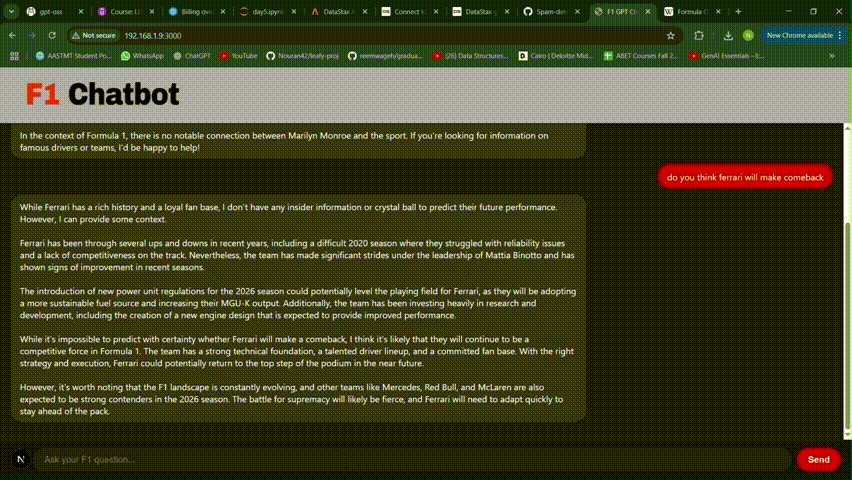

# Formula 1 Chatbot

F1 chatbot is an AI-powered chatbot for Formula 1 fans.

# DEMO



## 📖 Overview

F1 chatbot is an AI-powered Formula 1 chatbot that uses **LangChain**, **AstraDB Vector Store**, and **Ollama LLaMA 3.2 open-source** for Retrieval-Augmented Generation (RAG).  
It retrieves facts from a curated Formula 1 knowledge base, then answers naturally in real time through a **FastAPI backend** and a **Next.js frontend**.

## ✨ Features

- **RAG-powered answers**: Combines vector search from AstraDB with a local LLaMA 3 model.
- **Beautiful chat UI**: Formula 1-themed chatbot interface built with Next.js.
- **Real-time responses**: Instant API calls from frontend to FastAPI backend.
- **Fully local**: No external API calls for inference.
- **Using web scraper**:used BeautifulSoup to scrape multiple website related to f1 content.

---

## 📂 Project Structure

```text
f1-rag-app/
│
├── src/
│   ├── app/                 # Next.js app router pages
│   ├── components/          # Chatbot UI components
│
├── main.py                   # FastAPI entry point
├── rag_retrieval.py          # Retrieval + LLM pipeline
├── store_f1_content.py       # Store scraped data in AstraDB
├── scraped_f1_content.json   # Formula 1 dataset
├── public/
│   ├── f1gpt.png             # Logo
├── requirements.txt
└── package.json
```

# Important Notes

- You'll need to download llama3.2 from Ollama "https://ollama.com"
- Create an astraDB database with the needed keys and store your hidden keys in .env file.
- install the important dependenies from **requirements.txt** using the command "pip install -r requirements.txt"

